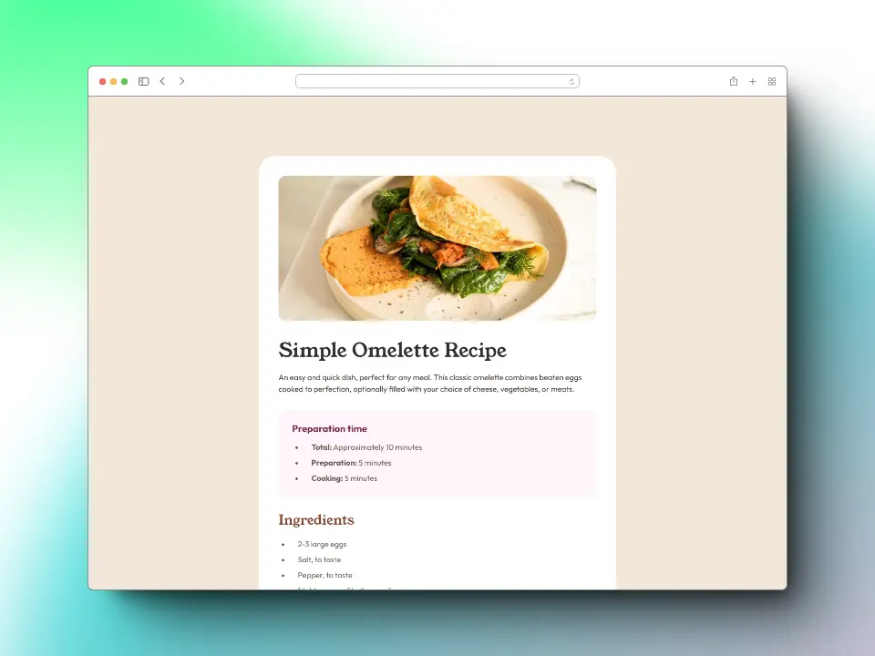

# Frontend Mentor - Recipe page solution

This is a solution to the [Recipe page challenge on Frontend Mentor](https://www.frontendmentor.io/challenges/recipe-page-KiTsR8QQKm).

Frontend Mentor challenges help you improve your coding skills by building realistic projects.


### Table of contents

- [The challenge](#the-challenge)
- [Screenshot](#screenshot)
- [Links](#links)
- [Built with](#built-with)
- [What I learned](#what-i-learned)
- [Useful resources](#useful-resources)
- [Author](#author)

## *The challenge*

🎯 Your challenge is to build out this recipe page and get it looking as close to the design as possible.

## *Screenshot*

### 📱 Mobile


### 💻 Desktop



## *Links*

[Live site](https://mendez-v.github.io/recipe-page/) 👀

[Solution in Frontend Mentor](https://www.frontendmentor.io/solutions/recipe-page-bw0MazoaPA) 👀

[All my challenges completed](https://github.com/mendez-v/frontend-mentor-challenges) 👀

## *Built with*

📌 Semantic HTML5 markup

📌 CSS custom properties

📌 Utility classes

📌 Mobile-first workflow

## *What I learned*

🔰 `border-collapse` -  sets whether cells inside a <table> have shared or separate borders.

🔰 `border-spacing` - sets the distance between the borders of adjacent cells in a `<table>`. This property applies only when border-collapse is separate.

🔰 `:not()` - represents elements that do not match a list of selectors. Since it prevents specific items from being selected, it is known as the negation pseudo-class.

```css
.nutrition__table {
  border-collapse: separate;
  border-spacing: 0 .01rem;
}

.nutrition__table tr:not(:last-child) td {
  border-bottom: 1px solid var(--light-grey);
}
```

## *Useful resources*

📑 `border-collapse` - [MDN web docs](https://developer.mozilla.org/en-US/docs/Web/CSS/border-collapse)

📑 `border-spacing` - [MDN web docs](https://developer.mozilla.org/en-US/docs/Web/CSS/border-spacing)

📑 `:not()` - [MDN web docs](https://developer.mozilla.org/en-US/docs/Web/CSS/:not)

## *Author*

✨ Frontend Mentor - [@mendez-v](https://www.frontendmentor.io/profile/mendez-v)